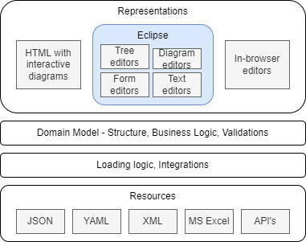
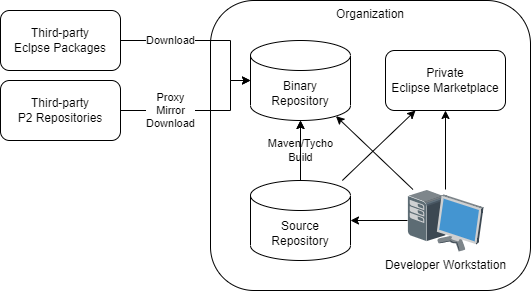
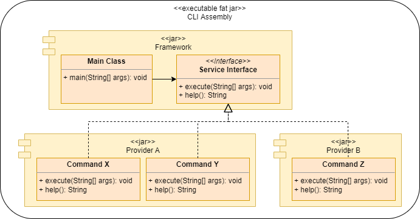

# Pavel Vlasov Cover Letter

This document is complementary to my [CV](index.html). 
It is called a _cover letter_ because:

* One of the goals of the a cover letter is to communicate that you have something valuable to contribute.
* A cover letter is usually a companion artifact to a resume.

However, I don't have a resume, I have a CV, which is longer.
So this cover letter is not a "classic cover letter", it is more a white paper.
It contains descriptions of ideas which I've accumulated over the years observing how large software engineering organizations operate and challenges they face. 
As such, most of the ideas aim to improve internal working of such organizations. 
 
It is a long read and I hope you'll find something of interest for your org. 
Most likely some of the ideas wouldn't be applicable in your context.

Some of the ideas below can be categorized as explained below and some can be applicable to more than one area:

* Product/Service - how to build or improve an offering - something which the organization will benefit from.
* Procurement - how to find resources, e.g. people with right talents and some capacity to build/improve an offering or work on an idea.
* Delivery - how to get an offering to its consumers.
* Promotion - how to make potential consumers of offering existence and its potential value to them.

A brief note on terminology.

In this document the word _engineering_ means _“The action of working artfully to bring something about.”_.
For example, a more efficient organization, or a person ready for a their next role.

Also, the word _model_ in this document may mean the following:

* Something with a structure or explaining defining or explaining the structure of something else (meta-model).
* Partial representation of the underlying problem domain focusing on a particular aspect of it. A model is a map, not a territory. In this sense all models are wrong (by design), but some are useful.

This is not an academic paper and not a textbook, so you may have to use your judgment regarding the different aspects of the meaning of some terms.

* TOC
{:toc}

## MBSE

MBSE stands for [Model-Based Systems Engineering](https://en.wikipedia.org/wiki/Model-based_systems_engineering).
There are sophisticated MBSE tools such as [Capella](https://www.eclipse.org/capella/) for designing complex systems architecture. 

The approach to MBSE explained here can be described as:

* Pragmatic
* Democratic
* Elaborationist all the way to the runtime/end product

It came to be based on the following observations:

* When a group in an organization starts using a modeling tool while the rest of the organization doesn't use it then an [ivory tower](https://en.wikipedia.org/wiki/Ivory_tower) situation arises. Even if the underlying tooling is free there is a cost of learning.
* Developers even with the access to a graphical tool often edit the underlying resources such as XMI directly in a text editor. 

The approach is pragmatic because it is based on free open-source tooling and runtime and produces Maven jars which can be used in any Maven-based Java application, e.g. a micro-service.

It is democratic because it can be made a public good in an organization and doesn't require extensive training:

* If a person knows how right-click in the file explorer to create a new file they should be able to create meta-models.
* If a person knows how to create a bulleted list in MS Word or PowerPoint, they should be able to create/populated models.
* HTML documentation is generated from the models and published for everybody to see and understand - forming a "Ubiquitous language" of the organization.
* Model jars are published to to a Maven repository for Java developers to use them in their applications.

It is elaborationist because it supports model transformation pipelines - one model is transformed to another with adding details as needed until it gets transformed to a final consumable artifact, e.g. a static web site or generated code.

There is an aphorism "All models are wrong, but some are useful". If we define usefulness as positive ROI and short time to market, then with this approach to modeling it is easier to create a useful model because production and publication of a model requires less effort than alternative approaches, e.g. no need in an initial investment into a model editor.

The value proposition of this approach:

* Low code (modeling and generation) and low tech (ability to load from YAML and other resources which do not require specialized editors) result in low cost.
* Meta-model provides common "ubiquitous" language.
* Model documentation makes this language widely available.
* Visualizations of the model structure make it easier to grasp the model. Package diagrams provide the "big picture".
* Class context and inheritance diagrams provide a focused view of a particular class and the classes it collaborates with.
* Documentation is linked to model elements which provides fine-grained structure and makes it easier to capture and find details.
* Documentation may contain diagrams defined in text. E.g. documentation for a class may contain a component diagram, for an attribute a state diagram, and for an operation a sequence diagram.
* Loading from different resources provides an abstraction layer allowing developers focus on business rather than integration logic.
* Structured data captured in a "low-tech" way - as text. No need in hosting databases - your version control system is your database with a time dimension. Data can be produced by both humans and systems. Capabilities of modern computers can easily handle models with millions of elements - it might not be enough to process runtime data such as log entries, but is more than enough to model organizations, software systems, cloud deployments, etc. Runtime data can be pulled in an aggregated form.
* Collaboration - text-based artifacts in version control. Branch/fork, create a pull request, merge using the same tooling which is used for source code, no need in specialized model diff/merge tools.

The below diagram shows the elements of the approach: 

 [^1]

[^1]: Created with [diagrams.net](https://www.diagrams.net/) desktop editor.

### Domain model

Developers capture the problem domain knowledge in Ecore models as classes with attributes, references and operations.
Classes and other classifiers - Enums and Data types are organized into packages.
Models can cross-reference each other - one model can use or extend classes from another model.

Documentation is generated from the models with [Nasdanika HTML Ecore](https://docs.nasdanika.org/modules/html/modules/ecore/index.html) and published to a web/intranet sites.
A documentation site may contain documentation generated from multiple models. 
[Documentation example](https://docs.nasdanika.org/modules/core/modules/flow/index.html).

The model may contain validation and business logic. 

Java code is generated from the models and can be packaged and deployed as a Maven jar. [Example](https://mvnrepository.com/artifact/org.nasdanika.core/flow).

### Loading logic and Integrations

Ecore supports loading and saving from/to XMI files out of the box. 
With [CDO](https://www.eclipse.org/cdo/) is is possible to store models in a number of databases.

[Nasdanika EMF](https://docs.nasdanika.org/modules/core/modules/emf/index.html) provides ability to load models from any key-value source - YAML, JSON, ... 
If the source is YAML the loading logic may inject source markers into model elements - file, line, and column. 
And if the YAML is in a Git repository then a Git marker can be injected adding information about remotes and commit id allowing to trace the origin of a model element.
This may be important in scenarios where models are loaded from multiple resources or when there are multiple model transformations - the transformation logic may either copy the elements as-is along with their markers, or it may copy and retain the markers for traceability/auditability.

Developers may implement custom resources and resource factories to load model elements. 
E.g. an Excel file with a specifc structure can be loaded using a custom resource leveraging [Apache POI](https://poi.apache.org/). 
An issue object might be loaded from an issue tracking system using Java or REST API,
or an aggregated metrics object may be loaded from a monitoring system.

Loaded models may be used in Java applications to serve both as a model and anti-corruption level abstracting higher levels from storage implementation details.

### Resources

Models are loaded from local or remote resources identified by a URI, not necessarily a URL. 
It is possible to specify which resource factory to use for a particular URI, one way is extension matching.
As such a resource set - which you can think of as a single logical model - may be loaded from multiple different resources. 
Some of these resources may be human-crafted, some may be backed by automated systems. 

### Representations

A representation is a view of a model.
There might be different representations intended for different uses by different modelers.
In an organization a single "logical" models may leverage multiple representations and editing approaches for 
different parts of it. 
For example:

* Some modelers can input data in YAML/JSON format following load specification part of the published meta-model documentation.
* Some others may enter data into Excel spreadsheets in a shared location, e.g. OneDrive, not even being aware that they are "modelers".
* Some groups may used specialized representations/editors.  

This section outlines some of representation options.

#### HTML

Models can be used to generate HTML sites.
Dynamic behavior can be achieved in two ways:

* Single-page applications embedded into static content. Examples:
    * [All Issues](https://docs.nasdanika.org/all-issues.html) page with configurable columns and filtering.
    * [Site Search](https://docs.nasdanika.org/search.html)
    
[Nasdanika HTML EMF](https://docs.nasdanika.org/modules/html/modules/emf/index.html) provides base classes for creating site generators. 

HTML sites are read-only representations and as such they may also be considered to be transformation/generation targets explained below.

One flavor of HTML output is Eclipse Help - a "site" which can be "mounted" into the Eclipse Help System.

#### Eclipse tooling

##### Tree editors

Generation of a tree editor is a built-in functionality of [Ecore Tools](https://www.eclipse.org/ecoretools/). 
However, you'd need to deliver the editor to your modelers, which may be a challenge - see the [Eclipse ecosystem](#eclipse-ecosystem) section. 
E.g. not all of your modelers may know how to use Eclipse or have an ability to install it in their environment.

##### Diagram editors

Diagrams editors can be created with [Eclipse Sirius](https://www.eclipse.org/sirius/). 
While being a very powerful modeling technique, diagram editors require considerable investment. 
With Sirius, which makes creation of diagram editors very easy, the investment is not so much into building an editor, but more into training and adoption.

##### Form editors

Form editors can be created using [JFace Data Binding for EMF](https://www.vogella.com/tutorials/EclipseDataBindingEMF/article.html). 

##### Text editors

Text editors with syntax validation, highlighting, and auto-completion can be created with [Xtext](https://www.eclipse.org/Xtext/).

#### In-browser editors

Models can also be edited in a web browser using:

* A version control Web UI can be used as an in-browser editor for models stored in a text-based format, e.g. YAML, in a version control system such as GitHub
* [Sirius Web](https://www.eclipse.org/sirius/sirius-web.html)
* Form editors and other Eclipse UI using [Eclipse RAP](https://www.eclipse.org/rap/)
* A regular web application.

### Transformation/Generation Targets

Oftentimes in order to become useful a model needs to be transformed to another model or to some other format.
The target format is sometimes called a "Generation target" and the act of transformation is called "generation".

This section provides several examples of transformations and generations targets.

The first example is Nasdanika.org site which is generated from several models:

* Ecore models are transformed to [application models](https://docs.nasdanika.org/modules/html/modules/models/modules/app/index.html) by HTML Ecore. Diagram are generated from the models.
* Some of [Engineering model](https://docs.nasdanika.org/modules/engineering/modules/model/index.html) elements use the above generated models as "action prototypes". The engineering model is loaded from multiple YAML, Markdown, and drawio files stored in multiple Git repositories. After loading it is stored to an XMI format. Then it gets transformed to an application model.
* The application model is then combined with a [page template](https://github.com/Nasdanika/nasdanika.github.io/blob/main/engineering/page-template.yml) to produce a [resource model](https://docs.nasdanika.org/modules/core/modules/exec/modules/model/index.html).
* Then static HTML site files are generated from the resource model and a search index JavaScript file is generated from the site files.

[Nasdanika TOGAF ADM](https://docs.nasdanika.org/togaf/adm/activities/adm/index.html) flow model site is generated in a similar way:

* [Flow model](https://docs.nasdanika.org/modules/core/modules/flow/index.html) -> application model.
* Application model + page template -> resource model.
* Resource model -> HTML site.

#### REST API

A REST API can be created by exporting the model into a set of cross-referencing JSON files. 
Such API wouldn't be able to provide dynamic behaviors such as processing query strings, but can be good enough for a variety of cases.

#### JavaScript client

A JavaScript client with dynamic behavior can be generated from a model or from a meta-model. 
If generated from a meta-model such a client would retrieve model data from external resources, e.g. using the REST API explained above.
If generated from a model the client may contain the model data. 
It is also possible to have intermediary solutions - some data can be hard-wired into the client at generation time and some data may be retrieved from external resources. 

### Using models in Java code

It is also possible to use a loaded model directly without a transformation.
E.g. if some Java application/microservice has a complex configuration it may be beneficial to create a configuration model and publish model documentation, which includes load specifications.

Then, the generated model jar file can be used to load configuration from, say, YAML and validate it.
The application would read its configuration using model API's, which may also contain configuration-specific logic.

With this approach configurations may be validated/tested separately from the application.
They can be "pre-validated" and "pre-deployed" - loaded from YAML and other resources, saved as XMI and deployed to a binary repository, maybe as a Maven jar.

Having a configuration model also opens an opportunity to use Eclipse-based editors instead of or in addition to working with YAML or JSON in a text editor. 

### Object signing

The concept of object signing is similar to the concept of [jar signing](https://docs.oracle.com/javase/tutorial/deployment/jar/signing.html) and [JWT](https://jwt.io/introduction) signing - digital signatures are added to objects
which implement ``Signed`` interface in the same way as [markers](https://docs.nasdanika.org/modules/core/modules/ncore/Marker.html) are added to objects implementing [Marked](https://docs.nasdanika.org/modules/core/modules/ncore/Marked.html) interface at load time for YAML-based resources.
Signatures can be carried over during transformations along with the containing object similar to how markers are carried over.

Signed objects can verify the integrity of the features contained within it - both attributes and references.
When objects are signed using public/private key pairs, the signature also certifies that only the party holding the private key is the one that signed it.

Object signing can be used in models which are authored by multiple parties with different authorities. 
E.g. in the solution instantiation below there might be a configuration model for instantiating a public cloud application.
That model might have to be populated by multiple teams in the organization - developers, networking, security, architecture. 
Teams may sign their contributions to the model.
The instantiation process will check the signatures and will fail if, say, a model object which is supposed to be signed by a security team is not signed, the signature is invalid (it was modified after it was signed),
or it is signed, but not by the security team's private key.

In [Collaborative Decision Making as Code](#collaborative-decision-making-as-code) experts and decision makers may sign their analysis and decisions captured as models.

Signatures can also be used to track approvals.
In this case objects may have multiple signatures - author's signature and then reviewers/approvers signatures.

For models which are loaded from multiple source repositories one option to implement signing is to mimic jar signing - have a build process which is triggered on repository push. 
The build process would load the model from source files, e.g. YAML, inject signatures, store to XMI, and then publish a jar with the model to a Maven repository.
Downstream models would have the signed model jar as their pom dependency and load the model using the ``classpath://`` URI scheme.

## Solution Instantiation

Solution instantiation is a form of transformation of one or models into a "solution", e.g. a cloud application or a documentation site.
Code generation is another example of solution instantiation.

This section explains an approach which allows parallel evolution of the source models and the generated/instantiated solution with ability to re-instantiate a solution from the model preserving 
the changes made in the instantiated solution after it was instantiated. For example, manual edits in source files.

Creating a solution instantiator requires effort and as such there is a break-even point between instantiating solutions manually and building an automated solution instantiator to instantiate them repeatedly.
In other words, solution instantiators shall be used to instantiate "sibling" solutions aiming to solve "commonly occuring problems", that is - instantiate [patterns](https://en.wikipedia.org/wiki/Software_design_pattern). 

### Steps

#### Pattern

Define and publish a pattern. 
Pattern documentation shall specify "variation points" - what can be different between differnent instances. 
E.g. cache or database or a number of replicas. 

Patterns shall be defined by subject matter experts.
For example a cloud solution pattern shall be defined by people with a deep experience with cloud technologies, e.g. a cloud architecture group.

The published pattern has a value on its own without a solution instantiatior, because it may be created at a later point of time once the pattern has demonstrated its usefulness.

The pattern shall be treated as a product with releases and release numbers. 
It may be stored in a version control system and pattern documentation can be generated and published using one of
[Documentation As Code](#documentation-as-code) approaches.

#### Reference implementation(s)

Build a reference implementation demonstrating that the pattern "holds water". 
The reference implementation doesn't have to externalize the variation points, but it shall document them.
There might be several reference implementations for a single pattern demonstrating different combinations of variation points.

A reference implementation shall also be built and maintained by subject matter experts, not necessarily the same people who created the pattern[^2], e.g. cloud developers. 

[^2]: Or necessarily not the same people to prove that the pattern can be instantiated based on the published documentation.

As well as a pattern a reference implementation shall be treated as a product with releases and release numbers which can include pattern release numbers.

Documentation for reference implementations may be "mounted" under the pattern documentation so it is easy to find.
Documentation as code allows to achieve it via aggregation or federation. 

#### Instantiation and Configuration models

Once a reference implementation is published it can be converted into two models.

##### Instantiation model

Instantiation model reflects the constant part of the reference implementation.
It doesn't have to be a model, it can be a code.

One way to create an instantiation model is to use [Nasdanika Exec Model](https://docs.nasdanika.org/modules/core/modules/exec/modules/model/index.html) which is built on top of the [Nasdanika Execution Model](https://docs.nasdanika.org/modules/core/modules/common/features/execution-model/index.html). 
Additional execution participants can be created as needed.
Such participants may leverage existing generation solutions, e.g. [Spring Initializr](https://start.spring.io/) - out of the box or customized to organization's needs.
 
Nasdanika Execution Model supports rollbacks, which can be important for instantiation of complex solutions where one of instantiation steps may fail - in this case the instantiator will clean up afeter itself.

##### Configuration model

The configuration model contains variation points. 
It may be quite involved with conditional logic and validations, e.g. lookups in internal registries.
It is also likely that different parts of the configuration model would have to be populated by different roles within the organization with different authorities.
In this case the model may leverage some kind of signing or authentication tokens/permits which can be validated at the instantiation time. 
Such permits may have an expiration date. 

Configuration models may be stored in different formats and edited in a variety of ways as explained in the [MBSE](#mbse) section. 

If a configuration model is stored in YAML in Git one way to validate authority at the instantiation time is to check who's committed a particular configuration file or changed a particular line of code (using [blame](https://git-scm.com/docs/git-blame)). 
In this case if a developer modifies a configuration element which is supposed to be modified by an architect the instantiation will fail.

#### Instantiate

The instantiation process will:

* Load and validate the instantiation model.
* Load and validate the configuration model.
* Execute the instantiation flow as explained in the "Nasdanika Execution Model" mentioned above:
    * Diagnose
    * Execute
    * Commit or Rollback
    * Close
    
The instantiation process (or some of its parts) can be tested using the reference implementation(s) - given a specific input it shall produce the same resources as in the reference implementation.    

##### Example

* A web wizard is used to collect user input to create a new cloud application.
* The input collecting application creates a request YAML file and pushes it to a Git repository.
* A Jenkins job is triggered by the push. It inspects the commit message and starts the instantiation process passing the configuratin YAML to is as input. The process:
    * Creates Git repositories.
    * Generates code and pushes to the repositories.
    * Creates build jobs and triggers a build to the development environment

#### Evolution

Once a solution is instantiated there are three parts which may evolve independently:

* The instantiation model - there might be a new release of the underlying pattern or reference implementation and the model may get updated.
* The configuration model, e.g. it might be decided to use a different caching solution.
* The instantiated solution - developers will modify the generated code to implement business functionality.

The solution instantiator merges the changes in the three "evolution streams" as explained below.

It re-executes the instantiation process.
For every resource (file, repository, database) the instantiation model would specify a [Reconcile Action](https://docs.nasdanika.org/modules/core/modules/exec/modules/model/resources/ReconcileAction.html) - what to do if the resource already exists.
In case of ``Merge`` the instantiator would do the following:

* Check if the resource was modified since the last instantiation. For version-controlled files one way to do it is to use jGit and see who last committed the file. If the committer ID is the same functional ID which is used for instantiation that would mean that the file was not touched and can be overwritten.
* If the resource was modified use a merger applicable for the resource format. For Java resources there is JMerge which detects manual changes using ``@generated`` JavaDoc tags - it overwrites only classes and members with such tag present. Other file resources can be merged using a 3-way patch in a version-controlled environment, which is[^3]: 
    * Find the previous generated revision
    * Do a diff between the previous and the newly generated code and create a patch. There are Java libraries to do diff/patch for [text files](https://github.com/google/diff-match-patch) and for formats such as [JSON](https://github.com/java-json-tools/json-patch/blob/master/src/main/java/com/github/fge/jsonpatch/diff/JsonDiff.java) and [XML](https://github.com/dnault/xml-patch).
    * If there is no difference do nothing - keep the current revision as it is.  
    * Otherwise apply the patch to the current revision.

[^3]: This is one option. Another option is to diff/patch between the previously generated and the current revision and then apply the patch to the newly generated content.

The re-instantiation process can be performed automatically on Git push, similarly to how the first instantiation
happens. In fact, it will be the same process with no pre-existing resources for the first instantiation.

One variation of a reconcile action for Git repositories may be "create a branch" - the instantiator would not commit changes to the same branch, but would create another branch. 
Then a build may be triggered off that branch and if it is successful and all tests pass then the branch maybe merged into the original branch or a pull request may be created.
If the build fails, then the development team would be notified and will review and fix problems caused by a merge.

### Value proposition

* Developers are inherently better at writing code than documentation - they wouldn't be developers but rather technical writers otherwise. With a well-established solution instantiation practice it might be easier and faster for developers to create solution instantiators than to create a detailed documentation for reference implementations.
* Instantiators are code and can be tested faster and cheaper than documentation.
* Solution instantiators shall produce the same result when given the same input. It is not always true for people.
* Extensibility - there might be "base" instantiators which define extension points to allow customization. It may be leveraged in a large organization where a central team produces such "base" instantiators and then regional/LOB teams customize them to their needs. The same approach can be applied to configuration models using template/prototype chains - a config model can define template/prototype or multiple templates/prototypes similar to how docker images define base image using ``FROM``.  

## Delivery mechanisms

The purpose of delivery mechanisms is to make right offerings available to the right audience. 
E.g. a solution instantiator of correct version to developers in team A, and a different version in team B, if these teams code against different releases or variations of the tech stack. 

A number of cloud providers make their client offerings available in 3 forms:

* REST API's
* CLI (Command Line Interface)
* IDE packages or plug-ins

All of these delivery mechanisms are products with releases and release numbers delivering a coherent set of offerings, e.g. multiple commands in the CLI.

Technology organizations may benefit from the same approach by assembling productivity boosters produced by
different teams into coherent packages. 
This approach will help with:

* Promotion - finding one package and then needed functionality within it is easier than finding just that piece of functionality
* Delivery - install a single package
* Credibility - a particular package version shall be assembled to work with a particular release or variation of the tech stack. It is easier to trust a single package than to multiple versions of multiple individual offerings.

This section provides some thoughts on how the delivery mechanisms and offerings can be implemented.

### Offerings

Where possible the offerings shall be coded in a delivery-mechanism independent way which, at the same time, integrates well with the delivery mechanisms.

The Nasdanika Execution Model is one of such mechanisms - it was inspired in part by Eclipse progress monitor and diagnostic and as such integrates well with Eclipse, e.g. progress dialogs.
There is also a CLI "adapter" for the Nasdanika Execution Model (see the CLI section).
And being a Maven library it can be used from Web applications, e.g. SpringBoot microservices.

Offerings shall be published as Maven jars to be later assembled into delivery packages.

### API

API's can be implemented with, say, SpringBoot microservices. 
It may not make sense to package some offerings as API's. 
For example, offerings which work extensively with a local file system and do not communicate with remote systems are better off as CLI or IDE plug-ins. 
Some offerings, though, may have a local part, e.g. scanning a directory, and a remote API part which the local part interacts with, e.g. storing digests of the files to a database or looking for the digests in the database. 

### Eclipse Ecosystem

The goals of Eclipse Ecosystem in an organization is to:

* Leverage external offerings in a controlled way
* Ability to build custom Eclipse packages (products) by extending packages provided by the Eclipse Foundation and other vendors, e.g. Spring Tool Suite.
* Ability to build and publish custom plug-ins including Eclipse Help plug-ins with documentation.
* Provide discovery mechanisms for offerings:
    * A portal listing downloads and update sites
    * Eclipse Marketplace server for installation in the IDE using Eclipse Marketplace Client

The diagram below shows a possible structure of such ecosystem.

#### Third-party Eclipse Packages

Eclipse packages are typically distributes as zip files.
Some offerings come in two flavors - an Eclipse package to download and use and a P2 repository to install into an existing Eclipse.
Third-party packages shall be downloaded by an authorized group within the organization and stored into a binary repository.

#### Third-party P2 Repositories

A P2 repository (update site) is a collection of Eclipse plug-ins and features. 
They come in several flavors: 

* A regular repository - a collection of files. Can be served locally or over HTTP.
* An archived repository - can be served locally. Has to be downloaded first if remote.
* A composite repoisitory - a collection of references to other repositories. Can be served locally and remotely.

Depending on the repository flavor it can be mirrored or downloaded. 
It can also be proxied if the organization's binary repository supports proxying of P2 repositories.

#### Binary Repository

A binary repository may be a simple directory on a web server where third-party packages are downloaded, thrird-party repositories are mirrored or downloaded, and internal repositories are deployed.

Or it can be a specialized binary repository which may support proxying of P2 repositories.

It can also be a combination of the above.
E.g. if all binaries are to be stored in a specific repository because it is requied by the organizational policies, but the repository does not support serving P2 repositories, then a P2 repository can be stored in the binary repository as an archive and then taken from it, expanded, and served over HTTP from a web server.

#### Source repository

Contains sources for in-house Eclipse solutions - plug-ins, products/packages, repository definitions including composite repositories.
It may also contain data for the Private Eclipse Marketplace.

#### Private Eclipse Marketplace

Allows to discover and install plug-ins from Eclipse using the [Eclipse Marketplace Client (MPC)](https://www.eclipse.org/mpc/). 
The marketplace shall provide [Marketplace REST API](https://wiki.eclipse.org/Marketplace/REST).
It may also feature Web UI to use from the outside of Eclipse IDE. 

A simple implementation of a Private Eclipse Marketplace can be built with [MBSE](#mbse) - data can be stored in one or more Git repositories.
It would be loaded into a model and the model would feed the REST API. 
Web UI can be generated from the model and may contain dynamic parts, e.g. search.

The marketplace can be re-deployed with new data on regular intervals or on Git push, with possible throttling.
Moderation of changes can be done using pull requests.

The Web UI can also serve as a discovery portal for P2 repositories and Eclipse packages.
As a matter of fact, it makes sense to start with a discovery portal and then add Marketplace functionality to it.

#### Developer Workstation

There would be two types of developers:

* Consumers - these people download Eclipse packages and install plug-ins.
* Contributors - these people also develop packages and plug-ins. They push their code to the source repository. It would trigger a build. For plug-ins, products, and repositories it would be a Maven/Tycho build deploying a product or repository to the binary repository. For marketplace/portal entries the build would deploy a new version of the portal/marketplace.

### CLI

Organization CLI can be implemented as as command suite using [picocli](https://picocli.info/). 
[Nasdanika Core CLI](https://docs.nasdanika.org/modules/core/modules/cli/index.html) is built on top picocli and provides ability to use the Nasdanika Execution Model from the command line. 
It also provides HTML documentation generator - [documentation example](https://nasdanika.org/builds/develop/doc/reference/cli/nsd/codegen.html).
[Nasdanika Core EMF](https://docs.nasdanika.org/modules/core/modules/emf/index.html) adds command classes which allow to load and execute models.

The below diagram shows how a CLI command suite can be implemented in a decoupled way leveraging [Java service providers](https://www.baeldung.com/java-spi).

* The core framework defines a main class and a service provider interface. The main class discovers service provider implementations and delegates to them. Service provider methods on the diagram are just for example. The real service provider would have more methods, in particular methods for building command hierarchies by bottom-up linking of child commands to parent commands.
* Provider jars contain commands implementing the service provider interface.
* The assembly is a [fat jar](http://tutorials.jenkov.com/maven/maven-build-fat-jar.html) with provider dependencies in ``pom.xml``.  

### Documentation as code

Documentation as code is not a new concept - it is widely used to generate documentation sites, 
e.g. many Apache products including [Maven](https://maven.apache.org/index.html) use [Maven sites](https://maven.apache.org/plugins/maven-site-plugin/) generated documentation.

This section provides an overview of serveral documentation as code solutions which provide more advanced functionality than Maven sites.

Please note that documentation as code is an example of both solution instantiation (generated) and delivery mechanism (delivers knowledge).

#### Application model

The [application model](https://docs.nasdanika.org/modules/html/modules/models/modules/app/modules/model/index.html) allows to define a hierarchy of [actions](https://docs.nasdanika.org/modules/html/modules/models/modules/app/modules/model/Action.html) from which a web site or other type of documentation can be generated.
The action model is conceptually similar to Maven's ``site.xml``, but provides more functionality such as navigation actions, sections, drop-downs, tabs, etc.
Action models can be defined in YAML or XML and can reference markdown and other resources locally, retrieved from remove locations, or generated.

Some feature of the action model approach:

* [20+ Bootstwatch themes](https://bootswatch.com/4/)
* Generation of a JavaScript-based built-in search scoped to a site. No need to host a search engine. [Example](https://docs.nasdanika.org/search.html).
* Diagrams generated from fenced UML blocks. [More info](https://docs.nasdanika.org/modules/core/modules/exec/modules/model/content/Markdown.html#embedded-diagrams).
* Dynamic behavior with either Single Page Applications, or by serving the action model on a per-page basis from a dynamic app such as SpringBoot web app. These two approaches can be combined. The search above is an example of a Single Page Application. Another example: [All issues](https://docs.nasdanika.org/all-issues.html) - filterable and configurable table.
* Aggregation of several models into a single site.

The action documentation is an example of a site page generated from the application model.

Application models can be used to create sites without a specific backing structure.
They can also be used to create a high-level action structure with lower-level action hierarchies "mounted" at specific locations.

Journey and Engineering models explained below are first converted to application models and then those action models are used to generate web sites.

#### Flow model

[Flow models](https://docs.nasdanika.org/modules/core/modules/flow/index.html) allow to define how to achieve
outcomes by performing a graph of [activities](https://docs.nasdanika.org/modules/core/modules/flow/Activity.html) by [participants](https://docs.nasdanika.org/modules/core/modules/flow/Participant.html) using [resources](https://docs.nasdanika.org/modules/core/modules/flow/Resource.html) and consuming and producing [artifacts](https://docs.nasdanika.org/modules/core/modules/flow/Artifact.html). 

Example: [TOGAF ADM Flow](https://docs.nasdanika.org/togaf/adm/activities/adm/index.html) (partial).

#### Engineering model

[Engineering models](https://docs.nasdanika.org/modules/engineering/modules/model/index.html) provide structure to describe "bringing something about" - [organizations](https://docs.nasdanika.org/modules/engineering/modules/model/Organization.html) with [engineers](https://docs.nasdanika.org/modules/engineering/modules/model/Engineer.html) building [products](https://docs.nasdanika.org/modules/engineering/modules/model/Product.html) by working on [issues](https://docs.nasdanika.org/modules/engineering/modules/model/Issue.html). 

Engineering models can be used for documenting software components (and other things) where it is important not only to communicate what a component/product does, but also:

* Why it does it this way - alignments to [persona](Persona.html) [goals](Goal.html), [objectives](Objective.html), and [principles](Principle.html).
* Planned functionality (roadmaps) - [releases](https://docs.nasdanika.org/modules/engineering/modules/model/Release.html) planned for [increments](https://docs.nasdanika.org/modules/engineering/modules/model/Increment.html)

Some potential uses of engineering models:

* Documentation portals for internal shared/reusable components
* Solutions built with InnerSource approach
* Ideation/Innovation - see the innovation pipeline below.

[Example of a site generated from an engineering model](https://docs.nasdanika.org/index.html).

## Innovation pipeline

A large organization typically has a large number of improvement opportunities and a large number of innovation ideas generated. 
These opportunities and ideas come in different shapes and sizes and it is important to have a capability to
capture them, prioritize and execute leveraging available resources in an optimal way.

This section provides some suggestions regarding how it can be down in a relatively low-tech way.
The process is inspired in part by the [Eclipse Foundation Development Process](https://www.eclipse.org/projects/dev_process/).

The innovation framework can be documented using the flow model, so the entire organization has a clear understanding of the innovation process.

Ideas can be captured using the engineering model possibly in combination with flow models to capture customer journeys:

* Document WHO would be using/benefiting from the idea - personas and their goals. With a well-established innovation pipeline shared persona definitions can be used at this stage. Published shared persona/goals definitions may inspire ideas how to address them.
* Document WHAT is offered - products and features and WHY - align to persona goals.
* Document HOW - elaborate features into issues.
* Document WHEN - group features and issue into releases.
 
The idea does not have to be captured in its entirety before submission.
E.g. it may contain just a vision from which other elements will be elicited at later stages.

An idea definition can be stored in a version control repository.
E.g. a personal repository of the initial author of the idea.
Once the initial definition is stored in a version control the author submits a request to publish their idea to 
an idea portal so it can be discovered and reviewed by others. 
The portal can also be build using the engineering model. 

The innovation community reviews the submitted idea and may provide feedback. 
Some community member may collaborate with the idea author to elaborate the idea further in an InnerSource fashion.

If the idea requires funding or other form of leadership engagement the idea community may submit a request
for funding/sponsorship.
The request would be reviewed by a governing body, say "Innovation Steering Committee" which would decide the course of actions.
Another possibility is to support ideas with most active communities.

With this approach each innovation voice can be heard. 
It will also drive collaboration across teams within the organization.

## Organization engineering

Organization engineering means improving organization efficiency by observing its behavior 
and implementing incremental changes.

The overall approach is to:

* Build a model of an organization with multiple contributing sources:
    * Manual input stored in a version control system including:
        * Descriptions of organizations/teams and their members 
        * Principles
        * Goals
        * Strategic Objectives 
    * Pull data from multiple systems such as:
        * Organization directory
        * Communication providers:
            * Mail servers
            * Video conferencing
        * Analytics, e.g. visitors of a site published by a team/person
        * Feedback, page/document ratings
* Perform model analysis. E.g. identify bottleneck teams and people with high "packet loss rate" - not reading e-mails, not attending meetings because they are multi-booked, starting/joining meetings late. Or people scheduling meetings which are not attended or sending e-mails which are not read.
* Generate and publish documentation/reports from the model. Different types of documentation and reports for different audiences.        
            
### Organizational insight

Organizations may benefit from sites/portal which provide in-depth information about the organization structure and its members. 
E.g. in addition to publishing a reporting structure (org charts) it might be beneficial to publish a short bio/resume of organization members, their job responsibilities, goals, or even asks for help. E.g. I have this backlog of problems, would appreciate help in solving them[^4].

[^4]: This one aligns with the innovation pipeline. I.e. the pipeline can also be an "exchange" with bids and asks - problems and ideas how to solve them. They can be both ideas - unelaborated ideas with just the WHAT and WHY would be problem statements.

One flavor or such reporting is a portal of components/products/services offered by a team (e.g. shared libraries) with each offering having assigned an owner engineer and engineer pages having an engineer bio, a list of components/products they own, and other information about them - participation in discussion forums, etc.

### Analysis

There is a lot in common between organizations and concurrent/distributed software systems - both consist of processing units (humans and automated systems in organizations and servers/cores/threads in software systems).
Processing units exchange messages to "activate” other units and together achieve a common goal.

E.g.

Kubernetes | Organization
---------- | ------------
Cluster    | Org unit
Node       | Site/Campus/Building
Pod        | Co-located team
Containers | Team members playing different roles

In this sense organizations can be monitored and "profiled" as computer systems to identify improvement opportunities (bottlenecks).

In computer systems there 3 types of bottlenecks:

* I/O
* CPU
* Memory

For humans we can identify the following types of bottlenecks:

* I/O - not reading e-mails, not responding to e-mails, not responding to meeting invites and not attending meetings.
* CPU - working long hours and on weekends.
* Memory - too many responsibilities and context switching between tasks. It has been shown that [context switching](https://dansilvestre.com/context-switching/) is extremely costly for humans - 20% drop in productivity for each additional task. It is similar to [thrashing](https://en.wikipedia.org/wiki/Thrashing_(computer_science)). It may lead to making sub-optimal decisions due to not investing enough time into [decision analysis](https://en.wikipedia.org/wiki/Decision_analysis).

#### Approach

* Information can be collected from multiple systems:
    * Messaging/Meeting servers:
        * Messages
            * Number of messages,
            * Number of unread messages,
            * Response rate and time to respond on messages that require response,
            * Number of recipients,
            * Organizational reach - recipient's positions in the organization. An [example](https://content.linkedin.com/content/dam/blog/en-us/corporate/blog/2011/01/alisnetwork-1.jpg) of org. reach visualization which can be generated from collected data. Data can be aggregated to make visualizations not as cluttered. There are many more [possible visualizations](https://echarts.apache.org/examples/en/index.html#chart-type-graph).
        * Meetings - number, overlaps, response rate (accept/deny).
        * Video conferencing - attendance, starting, joining, and ending on time.
* There is an option to mark a meeting invite and an e-mail as "Not relevant" and "Response required". E.g. a special category for "Not relevant" and a convention that people in the TO list are expected to respond. More feedback options may be identified going forward.
* Organization efficiency is analyzed based on hard and soft data - information pulled from systems, as well as surveys. For example - Meeting scheduling/Video conferencing cross-referencing - how many who accepted a meeting have attended, consistency of attending recurring meetings, e.g. scrum calls.
* Organizational changes are made based on data and then validated using newly collected data.
* E-Mail and meeting etiquette is an integral part of they organizational hygiene.
* Individuals may see where they are in their "organization fitness" similar to group comparisons in fitness apps. E.g. percentile in meeting attendance comparing to the person's department and the organization in total. Similarly, organizations can be compared.

#### Value proposition

Identifying and resolving organizational inefficiencies.
Examples of inefficiency:

* Decision makers do not attend meetings because they are too busy - decisions are not made, meetings get rescheduled, non-decision makers are in a waiting state which is a waste of company resources and detrimental to the workforce morale.
* People are late to open or join meetings, the group is waiting.
* People do not respond to meeting invites - other people wait for them and then have to reschedule.

## Collaborative Decision Making as Code

* Use [MBSE](#mbse) to create a meta-model supporting [Multiple Criteria Decision Analysis](https://en.wikipedia.org/wiki/Multiple-criteria_decision_analysis) methodologies such as [Analytic Hierarchy Process](https://en.wikipedia.org/wiki/Analytic_hierarchy_process), [Weighted Product Model](https://en.wikipedia.org/wiki/Weighted_product_model), [Weighted Sum Model](https://en.wikipedia.org/wiki/Weighted_sum_model).
* Publish model documentation.
* Optionally create a flow model documenting decision making flows. 
* Decision models are populated by multiple experts and are stored in a version control system in a single repository or multiple repositories, e.g. to enforce access control.
* Model aggregation can be done at the source level or "binary" level - models a published to a binary repository and then referenced by other models.
* Decision documentation is generated from the models.
* With multiple experts participating it is possible to have a hierarchy of experts following the criteria hierarchy and different weights for experts. E.g. a senior developer may have higher weight than a junior developer. 

Value proposition:

* Connected input collected from experts in different parts of the organization.
* Transparency and audit trail (commits).
* Ability to revisit a decision when circumstances change.
* Ability to drill-down to details why a particular alternative was assigned a certain rank.  
* Reuse - branch/fork, modify parts of the analysis. The model may also support inheritance and instead of branching and overwriting it would be extending and overriding.
* Decision chaining/aggregation. 
* With AHP it is possible to check for decision consistency at an individual expert level and cross-expert.

---

<html>   

        
</html>    