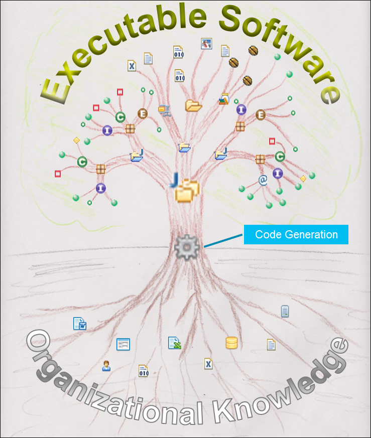

# Model-Driven Development

This article is about model-driven development and the benefits it can bring to software development.
In particular, the article explains how modeling can be leveraged to improve communication, capture and disseminate (organizational) knowledge, and reduce amount of manual work and errors. 

To demonstrate the value of Model-Driven Development I'm going to refer to:

* My favorite definition of software development, which I heard many years ago from Ivar Jackobson, goes as follows - _"Software development is a process of binding decisions to make them executable"_.
* [Building a pipeline vs. hauling buckets](http://www.getmotivation.com/prosperity/wealth-pipline-Robert-Kiyosaki.htm) story by Robert Kiyosaki - primarily relevant to model transformation/code generation.

When I started thinking about enterprise software development in terms of the above definition and pipline vs. buckets metaphor, I've realized that many traditional decision-binding processes are highly inefficient and fragile
- "buckets" of knowledge are hauled over and over for each new project - from one person or group to another through documents or conversations. 
Similar to the story, along the way the knowledge spills (people forget), gets dirty (misinterpretation) and becomes stale (gets outdated).

Also there is a great deal of manual binding of decisions - e.g. writing repetitive database access code which follows the same pattern for hundreds if not thousands of fields.  
   
Some of disadvantages of manual decision binding, such as repetitive coding mentioned above, are:

* Low speed of change propagation - if the database structure changes or the access pattern changes, then access code shall be manually re-coded. What actually happens more often is that the new and better pattern is never implemented - due to the risk of touching working code, and required time and effort - "What goes in, stays in".
* High cost.
* High probability of error - the old "To err is human".
  
## A very quick overview of EMF (Core)

Let's start with a quick look at [EMF](https://www.eclipse.org/modeling/emf/) because some modeling and code generation tools mentioned below are part of EMF, and some are based on EMF - these tools/frameworks are developed by the author and are available at [Eclipse Marketplace](https://marketplace.eclipse.org/) and/or [GitHub](https://github.com/nasdanika). 

In EMF one develops applications in the following way:

* Creates a domain model using either a [graphical editor](https://www.eclipse.org/ecoretools/), a tree editor, or [EMF-Forms based editor](https://www.eclipse.org/community/eclipse_newsletter/2016/february/article1.php). My preference is to start with a diagram editor to capture main model elements and their relationships and then switch to the tree editor for fine-tuning. A very important thing about the domain model is that it may define not only data - classes, attributes and references, but also behavior - operations.
* Generates model code and optionally edit and editor code.
* Implements business logic either as EOperations, or as external classes working on the model, or as a combination of thereof. 

One of very strong features of EMF is automated merging of generated and hand-crafted code. And a nice thing is that one can use this functionality in their [own code](https://github.com/Nasdanika/codegen/blob/118f9dc88f5f568d144564c6c5f623c0ce32ce74/org.nasdanika.codegen/src/org/nasdanika/codegen/java/impl/CompilationUnitImpl.java#L159). 

It is also possible to create models with [XCore](https://wiki.eclipse.org/Xcore), but I faced some issues trying to persist XCore-generated models into a CDO repository.

[XText](https://www.eclipse.org/Xtext/) uses EMF as common data layer, i.e. it generates EMF models from grammars and parses its DSL's sources into EMF models.

Once you have a model it can be:

* [Stored to and loaded from XML](https://gist.github.com/pvlasov/dec50db2d0e8e33aac19f7f18e6e081e).
* [Persisted to a repository](https://wiki.eclipse.org/CDO) for concurrent transactional access. 
* Edited in a generated tree editor.
* Edited in a diagram editor created with [Sirius](https://eclipse.org/sirius/overview.html).
* Viewed and edited in Web UI using either [EMF Client Platform](https://eclipse.org/ecp/) or [Nasdanika CDO Web Bundle](https://github.com/Nasdanika/server/tree/master/org.nasdanika.cdo.web).     
* Edited in an XText-generated editor with syntax highlighting and error checking.

Also models can cross-reference each other so a large logical model may be broken into several resources (e.g. files) with different lifecycles and owned/maintained by different teams.

There are many more cool features of EMF, e.g. transparent support of bi-directional references, change recording, CDO transaction handlers, validations, transparent resolution of proxy objects, ... but it's enough for a start.
You can check the web pages of different EMF technologies mentioned above to learn about how they can help you to build software better. 
In the following sections I'm going to provide a quick overview of Nasdanika CDO Web Bundle and Code Generators and explain several usage scenarios.

EMF make decision binding faster and more robust in the following ways:

* Organizational/domain knowledge can be captured in models. The models can be annotated with additional information, e.g. descriptions of model elements. 
* Model documentation can be published to internet/intranet so it is available to a wide audience for (re)view, refine and form a common understanding of the problem domain. 
* Information can be entered into the models using a wide variety of generated editors - diagram, web, text, tree, forms - with validation of data being entered. 

## Nasdanika CDO Web Bundle

Nasdanika CDO Web Bundle ``org.nasdanika.cdo.web`` allows to interact with objects stored in a CDO repository over HTTP. It does it in the following way:

* Each CDO object has a URL, by defaults something like ``http://myserver/myapp/router/objects/L123``. Under this URL an object may have sub-URL's mapping to features and EOperations.
* Contextual execution - for each request the routing servlet opens a transaction and "merges" HTTP request context and CDO transaction request context.
* A number of annotations are provided to declaratively match processing methods to request values, check authorization, apply repository locks and bind values to arguments of request processing methods/EOperations, e.g. request header value or OSGi service.
* Object/feature/operation level access control can be implemented declaratively in the model or programmatically. It also can be checked declaratively using method annotations or programmatically. In the latter case the application may modify its behavior based on principal entitlements.

All of this reduces amount of plumbing code - developers wire methods to requests with annotations and naming conventions and then focus on the request processing logic.      

The difference between this bundle and ECP is that ECP leverages [RAP](https://www.eclipse.org/rap/) and RAP is a Web widget toolkit which looks to the rest of the application as SWT components. 
This is a very powerful approach because it allows to expose existing SWT UI's to the web, but it doesn't support per-feature access control and non-widget requests, e.g. REST API calls.  
     
[Application rendering](https://github.com/Nasdanika/server/blob/master/org.nasdanika.cdo.web/doc/application-rendering.md) part of the bundle renders [Bootstrap](http://getbootstrap.com/)-based Web UI
using model metadata. Default rendering can be customized with model annotations and/or resource bundles properties and by overriding rendering methods. 
This approach follows 90/9/1 rule - 90% of time the default rendering does the job, 9% of time customizations maybe achieved using annotations and a rendering method override is required in 1% of cases.

Web UI elements for documented model elements feature help icons with tooltips. Mouse click on such icons opens a documentation dialog or navigates to the integrated model documentation (see below). This feature, along with the UI following the structure of the domain model, helps users to understand the UI behavior by studying the model documentation.  

This bundle was used to build a number of intranet web applications, including the [Cloud Console](../work-experience/citi/#cloud-console). 

## Nasdanika CDO Web Doc Bundle

and its companion documentation bundle ``org.nasdanika.cdo.web.doc``

TODO - screenshot(s)?

## Code Generation  

The core modeling technology, on which most of the other technologies mentioned in this article are built, is  - Eclipse Modeling Framework.    

80/20 principle. No coding is a myth - 2000 characters-long XPath expressions. As little coding as possible - heighten the level of abstraction.

improving communication

Tree picture.

extracting knowledge

speak to SME's using their language.

90% mistakes due to poor communication

Links to resume pages.

Vast enterprise metadata, including Word and Excel documents - example of pulling out mainframe data definitions from a Word document using Apache POE. Pull from SP, read Word doc.

Pull from SVN.

Information center, static model doc generation - in progress.

Codegen wizard model - minimal if any coding, saving the model for later re-use, possibility of using the Web UI for filling-out the model and then generating code.

Why CDO - XML and repo persistence.

Overview of model projects and their purpose - security - role-base access, how it is different from CDO security, cdo.web, code generators - ecore - bounded context, ...

Annotations - markdown, YAML. Validations. Multiple representations - editor, web, diagram (Sirius), grammar (XText/XCore). EMF Forms simplify user input.

Merging of manual and generated code. A person writing method implementations operates in the bounded context of the generated model - they can focus on the method to implement and higher level structure is generated from the models.

 
Codegen - constructing Java classes from pieces - different pieces might be owned by different teams and pull information from different sources.

Tried different metadata - database - limited, no behavior. XML - too much work to set up tooling/schema.

Early/late binding - generate-in, configuration at runtime

Problems with late binding: 

* No control 
    * Developers may mess at development time - misinterpret the design document.
    * Operations may mess at deployment time. 
* Hard to troubleshoot - limited access to production and too many permutations of configuration.

Effective knowledge is important in large organizations - repetitive patterns specific to the organization. Cookbooks are subject to interpretations, and sometimes don't get updated due to time pressures.

Addition vs. multiplication.

Improvement of internal processes.

Knowledge gathering - ask people of possible contribution - enter data into Word/Excel document and save on SharePoint, give them a tool, e.g. an intranet web application. Many a micle makes a muckle.

Right time binding.

Avoid EMF dependency - generate code and/or XML/JSON/YAML configuration.

Code merging, transformation. 

Mainframe -> MS Word - Apache POI -> model.

Screenshots - Generator model, Ecore editor - check, Generated doc (Info center and static later).

Multiple representaion of the same model - XText - https://www.eclipse.org/Xtext/, Sirius - https://www.eclipse.org/sirius/, different parts of the overall model may be created/edited by different editors.

compilation/translation vs interpretation

Merging - not everything can be generated.

## Knowledge pipeline

Kiosaki - http://www.reducestressnow.net/pipeline/ - Are you Hauling Buckets - or Building a Pipeline?

talk to SME - carry, spill. Pipeline - knowledge carried along and transformed automatically. Takes time to build. Makes sense for repetitive processes.

Organizational knowledge delivered to customers as executable software.

Alternative cost college education vs. work. 

Extending CI/CD pipeline.

## Chronology

How the vision evolved - AWK, Antlr/Hammurapi/Jsel, ...